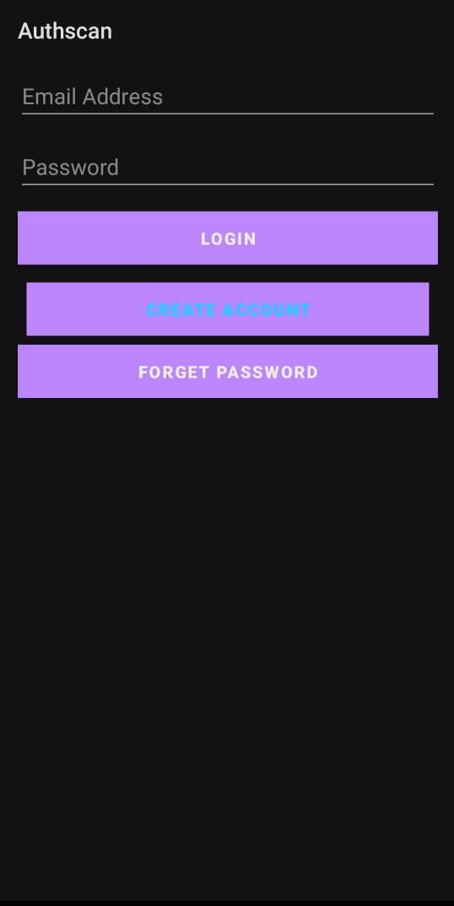
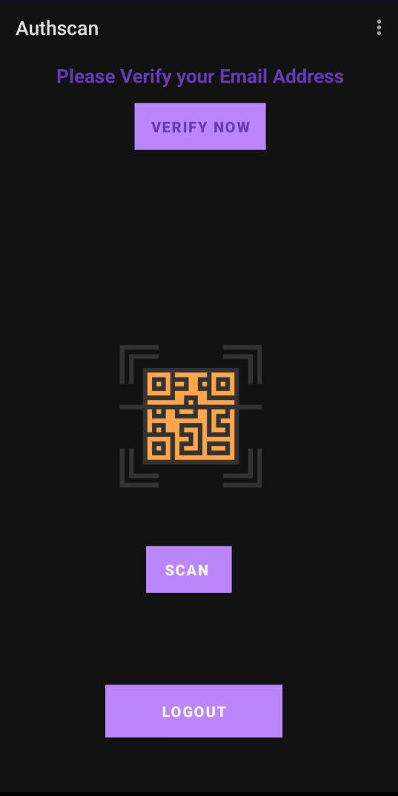
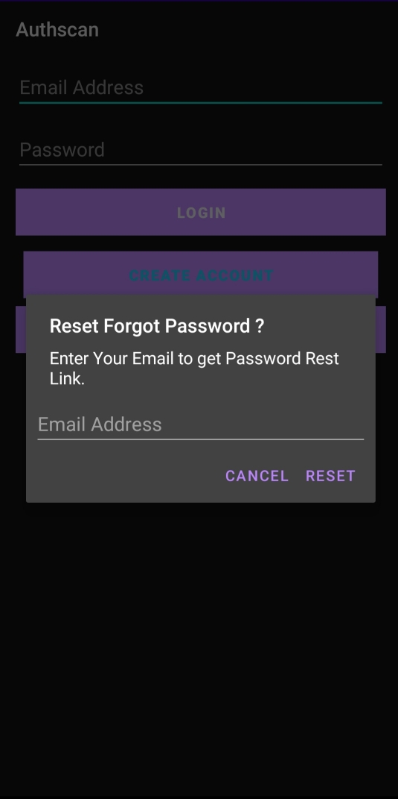
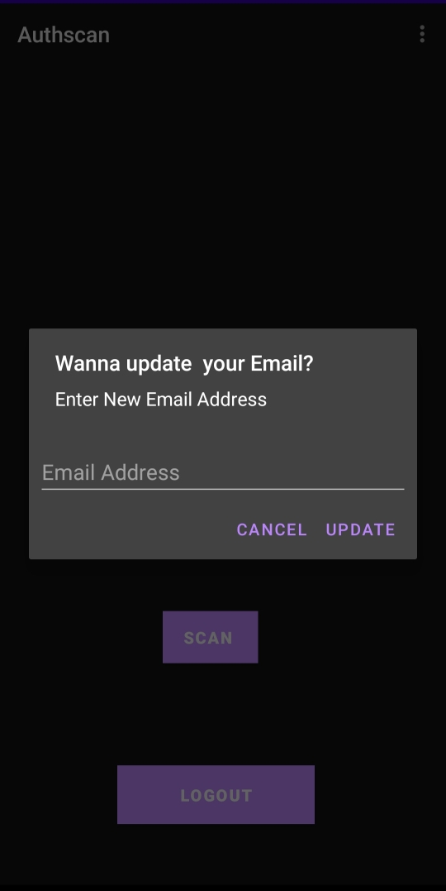

# QR-Code-Scanner
## ANDROID Qr code scanning-APPLICATION

**This application enables users to scan QR codes and also simaultaneously displays the TEXT scanned,Furthermore it also allows user to use flashlight while scanning the Qr codes.
following  KEY concepts were used to build this app.**

1.Firebase for managing the  login ,logout of user account . 
2. Code scanner library for Android, based on ZXing,for incorporating the Qr code scanning feature. 
3.Dexter library for requesting permissions during runtime. 

***

**The application enables users to do following Tasks:-**

1.Allows users to create thier account via email and password(Which is one time only i.e. for subsequent use the user is not prompted to login again). 
2.It also allows user to change password,email,logout of application or permanently delete his or her account on the application. 
3.Allows user to to scan Qr code only after assuring that camera permission has been granted. 

**FEW IMAGES OF THE APPLICATION**
 

